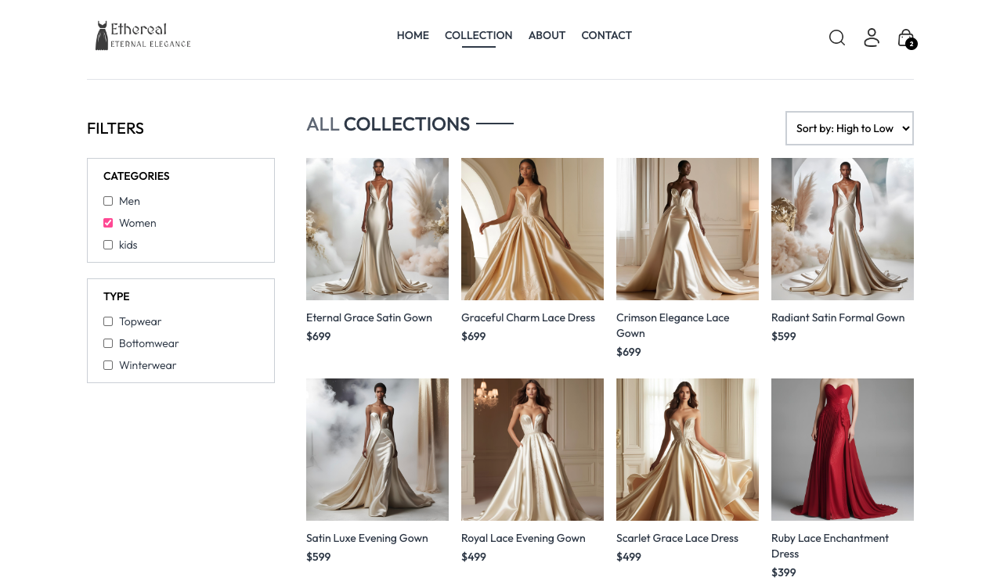
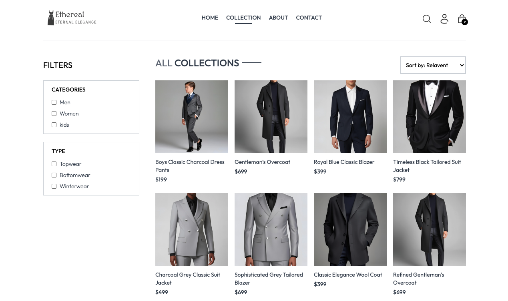
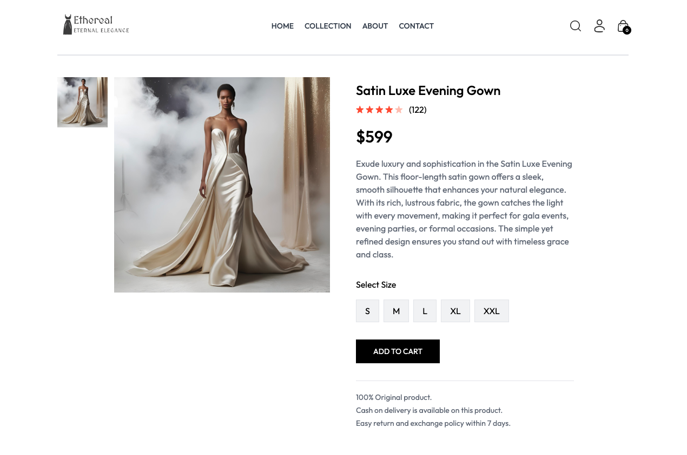
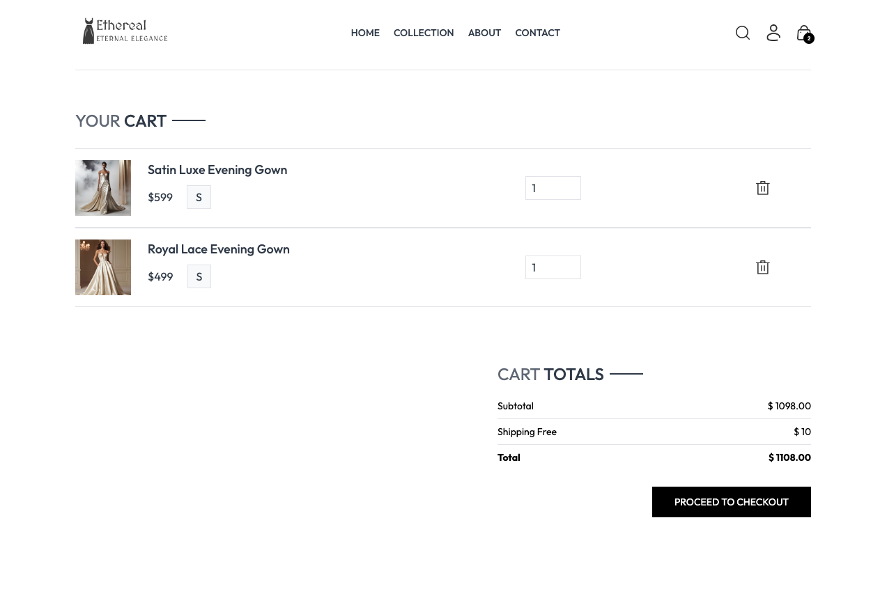
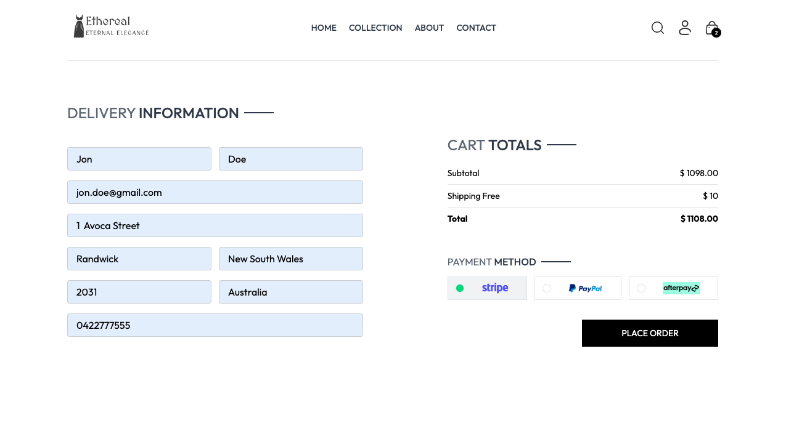
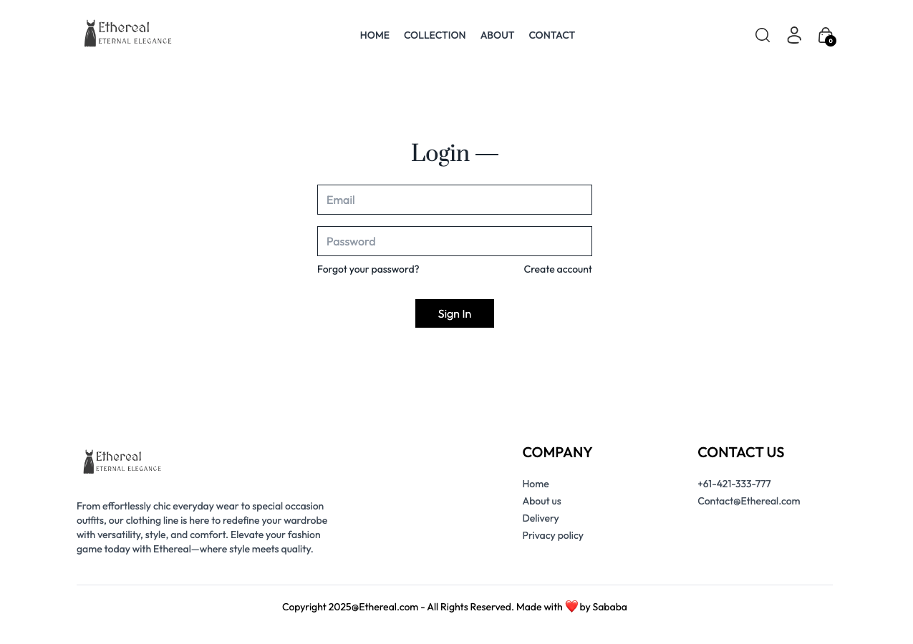
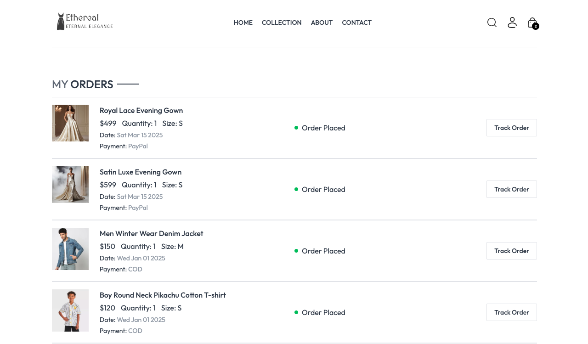
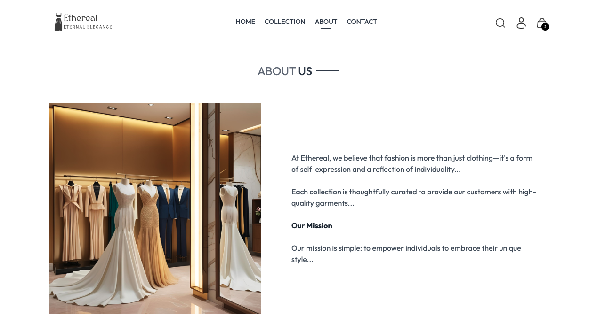

# Ethereal Apparel - E-Commerce Website

**Ethereal Apparel** is a modern and scalable e-commerce website built with the **MERN stack** (MongoDB, Express.js, React, and Node.js). This project is a full-stack single-page application (SPA) designed to deliver a seamless user experience with real-time data handling and smooth navigation.

  
_An overview of the Ethereal Apparel homepage_

## Technologies Used:

- **Frontend:** React.js
- **Backend:** Node.js, Express.js
- **Database:** MongoDB with Mongoose ODM
- **Authentication:** JWT (JSON Web Tokens)
- **Deployment:** Render for full-stack deployment
- **Version Control:** GitHub for source code management
- **CI/CD:** GitHub Actions for automated workflows

## Project Overview:

**Ethereal Apparel** offers an interactive, user-friendly platform for customers to shop for trendy apparel. With a focus on user interaction, it features a dynamic product catalog, user authentication, a shopping cart, and secure payment through Stripe. All data is stored and managed in a MongoDB backend, ensuring real-time updates across the platform. Fully deployed and functional, the website supports browsing, adding products to the cart, user authentication, and checkout.

---

## Key Features:

- **Interactive UI:** A sleek and modern design that makes browsing products and managing the shopping cart easy and enjoyable.
- **User Authentication:** Secure sign-up and login using JWT authentication for a personalized shopping experience.
- **Product Management:** Real-time updates of product availability, pricing, and descriptions fetched from the MongoDB database.
- **Shopping Cart:** Add/remove items to/from the cart with instant updates and smooth transitions.
- **Responsive Design:** Fully optimized for various devices using **Tailwind CSS**.
- **Image Hosting with Cloudinary:** Fast and reliable product image hosting via Cloudinary.
- **Deployment:** Hosted on **Render** to ensure scalability and availability.

---

## Live Demo:

- **[Live Frontend Demo](https://ethereal-frontend-theta.vercel.app)** – Explore the full shopping experience.
- **[Backend Demo](https://ethereal-backend.vercel.app)** – View the server-side API in action.
- **[Admin Panel Demo](https://ethereal-admin.vercel.app)** – Access the admin dashboard to manage products and orders.

---

## A Tour of the Site with Screenshots:

### 1. **Homepage Overview**  
This is where users land when they first visit the site. The homepage features a clean and modern layout, showcasing trending products.  
 

  
_The homepage features featured products, categories, and easy navigation to key sections._

### 2. **Product Catalog**  
Users can browse through a variety of products, each with its image, price, and description. Filtering and sorting options make it easy to find the perfect item.  
  
 
_The product catalog displays various items, along with options to filter and sort._

### 3. **Product Details Page**  
Clicking on a product gives users more details, including high-resolution images and a description of the product.  
 
_The product detail page provides an in-depth view of the item with options to add to the cart._

### 4. **Shopping Cart**  
Once products are added, users can view their cart, adjust quantities, or remove items.  
   
 _The shopping cart allows users to review their selections before proceeding to checkout._

### 5. **Checkout Process**  
A smooth checkout flow powered by Stripe, Paypal and Afterpay ensures users can securely complete their purchase.  
  
_The checkout process is streamlined and easy to follow, making it simple for users to complete their purchase._

### 6. **User Authentication**  
The login and registration screens allow users to create accounts or log in to access a personalized shopping experience.  
  
_Users can register or log in to access their account and view their order history._

### 7. **Orders Page**  
After a successful payment, users are redirected to their **Orders Page** where they can view past orders, track their status, and see the details of their previous purchases.  
  
_The Orders Page lets users easily track their order history and status._

### 8. **About Us Page**  
Learn about the brand’s mission, vision, and values on the **About Us** page.  
  
_The About Us page provides information about the brand, giving users a sense of who they are shopping with._

### 9. **Contact Page**  
Users can find contact information to get in touch with support or the team behind Ethereal Apparel.  
  
_The Contact Page offers users a way to reach out for any inquiries or support._

### 10. **Admin Panel**  
Admin users can log in to manage products, categories, and track orders.  

_The admin panel provides a powerful interface for managing products and monitoring orders._

---

## Project Structure:

```bash

├── README.md
├── admin
│   ├── eslint.config.js
│   ├── index.html
│   ├── node_modules
│   ├── package-lock.json
│   ├── package.json
│   ├── postcss.config.js
│   ├── public
│   ├── src
│   ├── tailwind.config.js
│   ├── vercel.json
│   └── vite.config.js
├── backend
│   ├── config
│   ├── controllers
│   ├── middleware
│   ├── models
│   ├── node_modules
│   ├── package-lock.json
│   ├── package.json
│   ├── routes
│   ├── server.js
│   └── vercel.json
├── frontend
│   ├── eslint.config.js
│   ├── index.html
│   ├── node_modules
│   ├── package-lock.json
│   ├── package.json
│   ├── postcss.config.js
│   ├── public
│   ├── src
│   ├── tailwind.config.js
│   ├── vercel.json
│   └── vite.config.js
└── screenshots
    ├── 1.png
    ├── 10.png
    ├── 11.png
    ├── 2.png
    ├── 3.png
    ├── 4.png
    ├── 5.png
    ├── 6.png
    ├── 7.png
    ├── 8.png
    └── 9.png
```
## Contributing:

-Fork the repository.

-Create a new branch (feature-branch-name).

-Commit your changes.

-Open a pull request.

## License:

This project is licensed under the MIT License.
